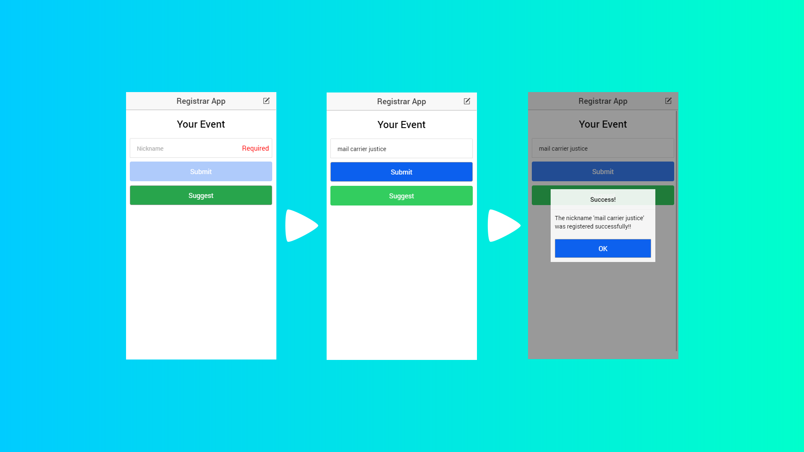
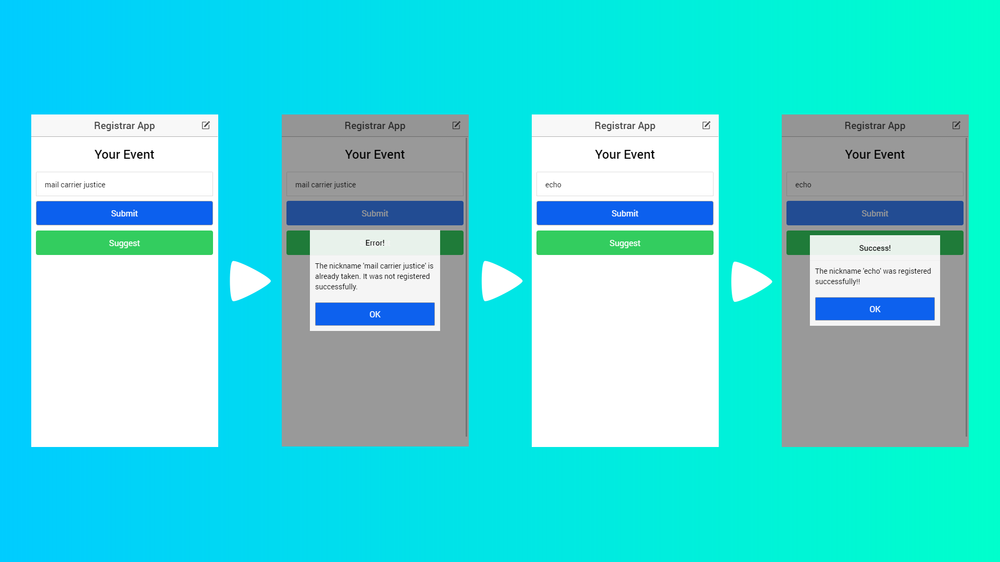
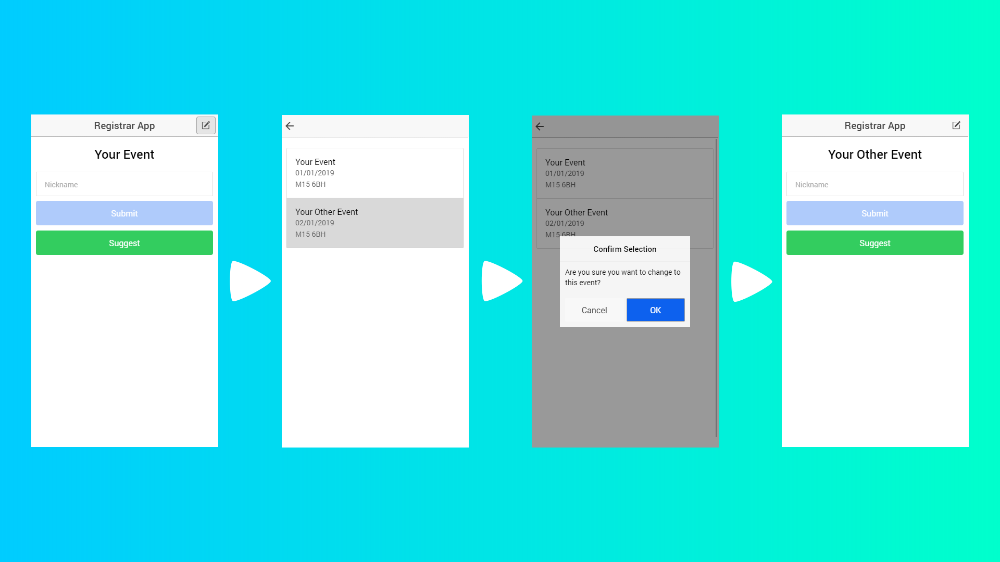

# Registrar App

Welcome to the RegistrarApp repository. This app is going to be used to register members of the public to the event that the admin has created on the **[EventCreatorApp][1]**. The app allows the user to register the members of the public to the event under nicknames. The user of the app also has the ability to change which event the members of the public are being registered to, though this should ideally be done once per event by the admin of the group that is running the event.

## Registering

Registering a member of the public to the event is simple once the app has been setup for the right event. The user, typically the person at the reception desk of the event, can add members of the public to the event by typing in a nickname and pressing the submit button. The user can also have the app suggest nicknames for them by pressing the suggest button or maybe ask the person they are registering if they would like to suggest the nickname that they will have. The app makes sure to check if a nickname has been entered and if it has then the app checks that the nickname is not taken when the user tries to submit it. If the nickname is taken, then the user is notified and they must enter another one using any of the methods mentioned. The following screenshots show the registration process using the suggest feature and both successful and failed attempts at registering a subject to the database.

Successful Registration

Nickname Taken

## Changing The Event

Changing which event the members of the public are being registered to is quite simple. To change the event, the user must tap on the edit icon in the top right of the registration screen which will show them a prompt to confirm that they want to change the event. Once the user has confirmed that they want to change the event, they will be taken to the Event List screen where they must select which event they want to change to. All the events in the database are shown in this list, much like the Event List sreen from the **[Event Creator App][1]**. The user will be prompted to select an event the first time they start the app as an event needs to be selected for the app to function properly. The following screenshots show the process of changing the event.

[1]: https://github.com/RatchetC/EventCreatorApp